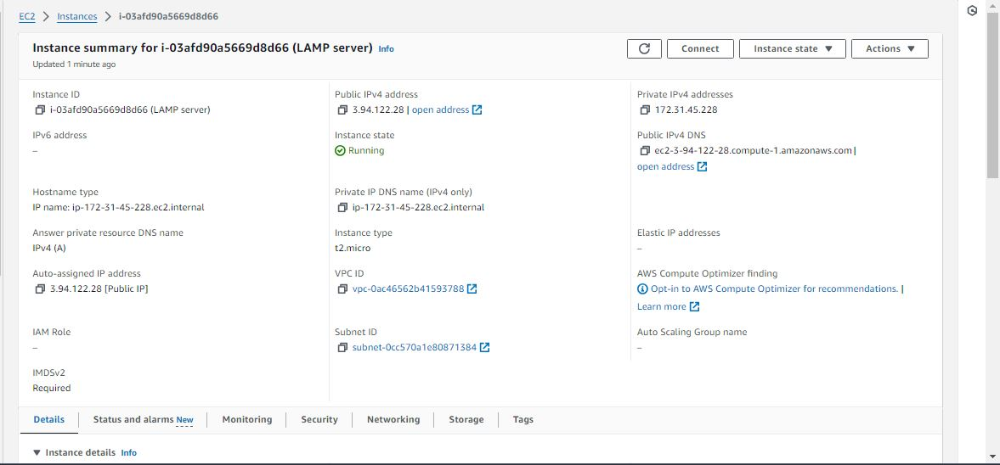

# WEB STACK IMPLEMENTATION (LAMP STACK) IN AWS

### Introduction

The LAMP stack is a popular open-source web development platform that consists of four main components: Linux, Apache, MySQL, and PHP (or sometimes Perl or Python). This documentation outlines the setup, configuration, and usage of the LAMP stack.

## Step 0: Prerequisites
1. EC2 Instance of t2.micro type and Ubuntu 24.04 LTS (HVM) was launched in the us-east-1 region using the AWS console.

   

2. Created SSH key pair named *LAMP stack key* to access the instance on port 22

3. The security group was configured with the following inbound rules:

- Allow traffic on port 80 (HTTP) with source from anywhere on the internet.
- Allow traffic on port 443 (HTTPS) with source from anywhere on the internet.
- Allow traffic on port 22 (SSH) with source from any IP address. This is opened by default.

  

4. Let's connect to our instance using SSH, then change the directory using the command `cd` into the folder where the private-key was downloaded. Permission was changed for the private key file using `chmod` and then I connected to the instance by `ssh` into it.

   

    ```
    cd Downloads

    chmod 400 "LAMP stack key.pem"

    ssh -i "LAMP stack key.pem" ubuntu@3.94.122.28
    ```


   

## Step 1 - Install Apache and Update the Firewall

1. Update and upgrade list of packages in package manager
    ```
    sudo apt update
    sudo apt upgrade -y
    ```
   

2. Run apache2 package installation

    ```
    sudo apt install apache2 -y
    ```
    

3. Enable and verify that apache is running as a service on the OS.
    ```
    sudo systemctl enable apache2
    sudo systemctl status 
    ```

    If it green and running, then apache2 is correctly installed.

    

4. The server is running and can be accessed locally in the ubuntu shell by running the command below:

        curl http://localhost:80
         OR 
        curl http://3.94.122.28:80
         
        
    

5. Test with the public IP address if the Apache HTTP server can respond to request from the internet using the url on a browser.
    ```
     http://3.94.122.28
     ```

    

This shows that the web server is correctly installed and it is accessible directly from the internet.

## Step 2 - Install MySQL

1. Install a relational database (RDB)

    MySQL was installed in this project. It is a popular relational database management system used within PHP environments.

    ```
    sudo apt install mysql-server
    ```

    
    
    


2. Enable and verify that mysql is running with the commands below:
    ```
    sudo systemctl enable --now mysql
    sudo systemctl status mysql 
    ```
    

3. Log in to mysql console

    ```
    sudo mysql 
    ```


    This connects to the MySQL server as the administrative database user root infered by the use of sudo when running the command.

4. Set a password for root user using mysql_native_password as default authentication method.

    Here, the user's password was defined as "Mayor123$"

    ```

    ALTER USER 'root'@'localhost' IDENTIFIED WITH mysql_native_password BY 'Mayor123$';
    ``` 

    

5. Exit the MySQL shell with:
    ```
    exit
    ```
    

## Step 3 - Install PHP

1. Install php Apache is installed to serve the content and MySQL is installed to store and manage data. PHP is the component of the set up that processes code to display dynamic content to the end user.

    The  following were installed:

- php package
- php-mysql, a PHP module that allows PHP to communicate with MySQL-based databases.
- libapache2-mod-php, to enable Apache to handle PHP files.

     ``` 
     sudo apt install php libapache2-mod-php php-mysql
     ```

    

    Confirm the PHP version.

    ```
    php -v
    ```

    

    At this point, the LAMP stack is completely installed and fully operational.

    To test the set up with a PHP script, it's best to set up a proper Apache Virtual Host to hold the website files and folders. Virtual host allows to have multiple websites located on a single machine and it won't be noticed by the website users.

## Step 4 - Create a virtual host for the website using Apache

1. The default directory serving the apache default page is /var/www/html. Create your document directory next to the default one.

    Created the directory for projectlamp using `mkdir` command below;

    ```
    sudo mkdir /var/www/projectlamp
    ```
    Assign the directory ownership with $USER environment variable which references the current system user.

    

2. Create and open a new configuration file in apache’s “sites-available” directory using vim.

    ``` 
    sudo vim /etc/apache2/sites-available/projectlamp.conf 
    ```
    Paste in the bare-bones configuration below:

    ```
    <VirtualHost *:80>
        ServerName projectlamp
        ServerAlias www.projectlamp
        ServerAdmin webmaster@localhost
        DocumentRoot /var/www/projectlamp
        ErrorLog ${APACHE_LOG_DIR}/error.log
        CustomLog ${APACHE_LOG_DIR}/access.log combined
    </VirtualHost>
    ```
    
    

3. Show the new file in sites-available

    ```
    sudo ls /etc/apache2/sites-available

    Output:
    000-default.conf default-ssl.conf projectlamp.conf
    ```

    

    With the VirtualHost configuration, Apache will serve projectlamp using /var/www/projectlamp as its web root directory.

4. Enable the new virtual host

    ```
    sudo a2ensite projectlamp
    ```

    

5. Disable apache’s default website.

    This is because Apache’s default configuration will overwrite the virtual host if not disabled. This is required if a custom domain is not being used.

    ```
    sudo a2dissite 000-default
    ```

    
    
6. Ensure the configuration does not contain syntax error.
    
    The command below was used:

    ```
    sudo apache2ctl configtest
    ```

    

7. Reload apache for changes to take effect.

    ```
    sudo systemctl reload apache2
    ```

    

8. The new website is now active but the web root **/var/www/projectlamp** is still empty. Create an index.html file in this location so to test the virtual host work as expected.

    ```
    sudo echo 'Hello LAMP from hostname' $(curl -s http://169.254.169.254/latest/meta-data/public-hostname) 'with public IP' $(curl -s http://169.254.169.254/latest/meta-data/public-ipv4) > /var/www/projectlamp/index.html
    ```

9. Open the website on a browser using the public IP address.

    ```
    http://3.94.122.28:80
    ```

    

## Step 5 - Enable PHP on the website

With the default DirectoryIndex setting on Apache, *index.html* file will always take precedence over index.php file. This is useful for setting up maintenance page in PHP applications, by creating a temporary *index.html* file containing an informative message for visitors. The index.html then becomes the landing page for the application. Once maintenance is over, the *index.html* is renamed or removed from the document root bringing back the regular application page. If the behaviour needs to be changed, **/etc/apache2/mods-enabled/dir.conf** file should be edited and the order in which the index.php file is listed within the DirectoryIndex directive should be changed.

1. Open the **dir.conf** file with vim to change the behaviour.

    ```
    sudo vim /etc/apache2/mods-enabled/dir.conf
    ```
    ```
    <IfModule mod_dir.c>
    # Change  this:
    # DirectoryIndex index.html index.cgi index.pl index.php index.xhtml index.htm
    # To this:
    DirectoryIndex index.php index.html index.cgi index.pl index.xhtml index.htm
    </IfModule>
    ```

    

2. Reload Apache

    Apache is reloaded so the changes takes effect.

    ```
    sudo systemctl reload apache2
    ```

    

3. Create a php test script to confirm that Apache is able to handle and process requests for PHP files.

    A new **index.php** file was created inside the custom web root folder.

    ```
    vim /var/www/projectlamp/index.php
    ```

    Add the text below in the **index.php** file.

    ```
    <?php
    phpinfo();
    ```

    

4. Now refresh the page.

    ``` 
    http://3.94.122.28/
    ```

    

This page provides information about the server from the perspective of PHP. It is useful for debugging and to ensure the settings are being applied correctly.

After checking the relevant information about the server through this page, It’s best to remove the file created as it contains sensitive information about the PHP environment and the ubuntu server. It can always be recreated if the information is needed later.

```
sudo rm /var/www/projectlamp/index.php
```

Conclusion:

The LAMP stack provides a robust and flexible platform for developing and deploying web applications. By following the guidelines outlined in this documentation, It was possible to set up, configure, and maintain a LAMP environment effectively, enabling the creation of powerful and scalable web solutions. LAMP is a popular solution that powers many of the websites we commonly use today.

